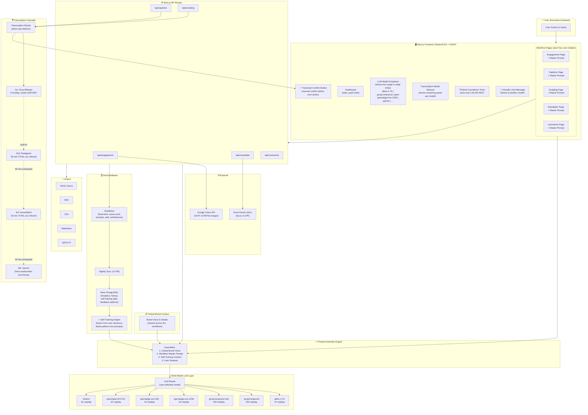
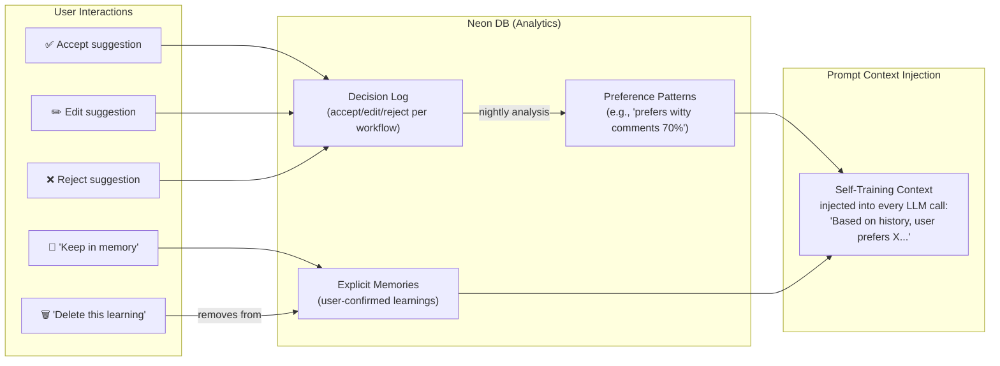

# TheAnors — Comprehensive Understanding & System Architecture (v2)

**Date:** August 18, 2026  
**Status:** Revised with all user feedback incorporated  

---

## 1. What TheAnors Is

TheAnors is a **zero-cost, self-learning content operations platform** built for an Executive Assistant managing a founder/brand's social presence across LinkedIn (personal + company), Instagram, TikTok, YouTube, and a weekly newsletter.

### Core Principles
1. **Never pay.** Operate entirely on free tiers and trial credits (₦0/month).
2. **Never crash.** Cascade between AI providers silently when limits are hit.
3. **Always learn.** The app self-trains from user decisions, becoming smarter over time.
4. **User is in control.** User selects models, confirms transcriptions, edits prompts.

---

## 2. The Prompt & Brand Voice System

> [!IMPORTANT]
> This is foundational — every workflow and every AI model must respect these prompts.

### 2.1 Global Brand Voice (Shared Across All Workflows)
- A **general input field** where the user enters the founder's brand voice, brand details, tone, audience, and KPIs.
- This is stored once and **injected into every single LLM call** across all workflows.
- All models (Gemini, Groq compound, Qwen, Allam, etc.) receive this as system-level context.
- User can edit it anytime from Settings.

### 2.2 Per-Workflow Master Prompts (Editable)
Each of the 5 workflows has its own **dedicated chatbot interface** with:
- An **editable master prompt** specific to that workflow (e.g., engagement tone, newsletter structure, caption style).
- The master prompt is stored and loaded every time the workflow is used.
- User can edit/update the master prompt at any time.
- All LLM models selected in the dropdown must **strictly follow** both the global brand voice AND the workflow-specific master prompt.

### 2.3 Self-Training Feedback Loop
The application **learns from itself** over time:
- Tracks which suggestions the user accepts, edits, or rejects.
- Records user corrections and editing patterns.
- Stores historical decisions in Neon DB (analytics database).
- Feeds learned patterns back into prompt context: *"Based on your history, you prefer X style..."*
- User gets suggestions that improve over time. User can:
  - **Accept** the suggestion
  - **Tell the app to keep the learning in memory** (reinforces the pattern)
  - **Tell the app to delete/forget** that particular learning

> [!NOTE]
> **On storage for self-training:** This is NOT fine-tuning a model (which would require massive GPU resources). Instead, it's **prompt-augmented learning** — storing text-based user decisions, preference scores, and pattern summaries in the PostgreSQL databases. Estimated storage:
> - **Supabase (active):** ~50–200 MB for active preferences, prompts, and recent history
> - **Neon (analytics/training):** ~500 MB–2 GB over 6–12 months of heavy use (all text, no media)
> - Both databases' free tiers comfortably handle this volume
> - The "training data" is compact text (JSON preference objects, prompt history, decision logs)

---

## 3. The Five Workflows

### 3.1 Content Scripting & Idea Creation (3–5x/week)

| Aspect | Detail |
|--------|--------|
| **Master Prompt** | Brand voice, target audience, KPI focus, content type preferences |
| **Chatbot** | Dedicated scripting chatbot with stored master prompt |
| **Input** | Brand guidelines, topic ideas, or links to creators' content (IG/TikTok/YouTube) |
| **Process** | Paste link → transcribe video (cascade) → LLM explains content → suggests repurposing angles → generates script options (talking head, carousel, flyer, trend acting) |
| **LLM** | Multi-model dropdown (all Groq models + Gemini) — user selects |
| **Transcription** | Cascade: Groq Whisper → Deepgram (30 min cap) → AssemblyAI (20 min cap) → Gemini |
| **Output** | Script options exported as Markdown/PDF/Word |

### 3.2 Engagement Management (Daily, 30+ posts)

| Aspect | Detail |
|--------|--------|
| **Master Prompt** | Founder voice, engagement style, relationship-building focus, platform tone |
| **Chatbot** | Dedicated engagement chatbot with stored master prompt |
| **Input** | Batch of 5–30+ LinkedIn/IG/TikTok post links |
| **Process** | Extract post content → LLM generates 3 comment options per post → user reviews, selects, copies, pastes manually |
| **LLM** | Multi-model dropdown — user selects from all available free models |
| **OCR** | Google Vision API for IG/TikTok image posts |
| **Output** | 3 comments per post, progress tracker (8/30), CSV export |

### 3.3 Caption Generation (3–5x/week)

| Aspect | Detail |
|--------|--------|
| **Master Prompt** | Tone per platform, SEO keywords (YouTube), character limits, CTA style |
| **Chatbot** | Dedicated captions chatbot with stored master prompt |
| **Input** | Video file upload, video link, or pasted script/carousel text |
| **Process** | Video → transcription (cascade) → user confirms transcript → LLM generates 5 platform-specific captions |
| **LLM** | Multi-model dropdown for caption text generation |
| **Transcription** | Cascade with manual confirm step: transcribed text displayed → user reviews/corrects → clicks confirm button → next action proceeds |
| **Output** | 5 captions (LinkedIn, TikTok, IG, YouTube title, YouTube desc), SRT/VTT, Word/CSV |

### 3.4 Newsletter Creation (Weekly, Fridays)

| Aspect | Detail |
|--------|--------|
| **Master Prompt** | Newsletter voice, structure (intro/body/CTA), tone (thought leader vs friend) |
| **Chatbot** | Dedicated newsletter chatbot with stored master prompt |
| **Input** | Uploaded Excel spreadsheet (`.xlsx`/`.csv`) with theme history + 2+ LinkedIn posts |
| **Process** | 1. Upload Excel → parse locally 2. LLM analyzes archive → generates theme suggestions 3. User selects/enters theme 4. User brings 2+ LinkedIn posts 5. LLM validates posts against theme 6. LLM synthesizes posts + theme → full newsletter draft |
| **LLM** | Multi-model dropdown — **not Gemini-only**, user can use any available model (Groq models, Gemini, etc.) |
| **Output** | Word document (`.docx`), theme recommendations, validation report |

### 3.5 Initial Comments (Per post, variable frequency)

| Aspect | Detail |
|--------|--------|
| **Master Prompt** | Comment styles (witty, thoughtful, question-based), length preferences, platform tone |
| **Chatbot** | Dedicated comments chatbot with stored master prompt |
| **Input** | Post link or content + platform type |
| **Process** | Extract post content → LLM generates 3 comment options with different tones adapted per platform |
| **LLM** | Multi-model dropdown — user selects model |
| **Output** | 3 comment options, CSV log |

---

## 4. The AI Provider Strategy

### 4A. All Available LLM Models (from Groq API + Gemini)

These models power **all 5 workflows** — text generation, comments, captions, newsletter drafting, scripting. The user selects from a dropdown and sees live limits.

#### Chat Completions (Text Generation)

| Model | Requests/Min | Requests/Day | Tokens/Min | Tokens/Day |
|-------|-------------|-------------|-----------|-----------|
| `allam-2-7b` | 30 | 7,000 | 6,000 | 500,000 |
| `groq/compound` | 30 | 250 | 70,000 | No limit |
| `groq/compound-mini` | 30 | 250 | 70,000 | No limit |
| `openai/gpt-oss-120b` | 30 | 1,000 | 8,000 | 200,000 |
| `openai/gpt-oss-20b` | 30 | 1,000 | 8,000 | 200,000 |
| `openai/gpt-oss-safeguard-20b` | 30 | 1,000 | 8,000 | 200,000 |
| `qwen/qwen3.6-27b` | 30 | 1,000 | 8,000 | 200,000 |
| **Gemini** (separate API) | 10/min | 1,000 | — | — |

> [!NOTE]
> `meta-llama/llama-prompt-guard-2-22m` and `meta-llama/llama-prompt-guard-2-86m` are safety/guard models (14,400 req/day) — these are for input filtering, not content generation.

#### Dropdown Behavior
- User sees all models with their **current usage vs. daily limit** displayed
- If a model's limit is hit, a friendly message appears: *"You've hit the daily limit for [Model Name]. Please select a different model from the dropdown to keep going for free!"*
- **No auto-switch** — user manually picks another model
- All limits reset at **1:00 AM WAT** — countdown timer visible in UI

### 4B. Transcription — Cascading Failover (Silent & Automatic)

User selects their preferred transcription model, and the UI shows remaining quota. If the selected model is exhausted, the system auto-cascades silently:

```
User uploads audio/video → selects preferred model
        ↓
┌────────────────────────────────────┐
│  1st: Groq Whisper                 │
│  • whisper-large-v3                │
│  • whisper-large-v3-turbo          │
│  • 20 req/min, 2K req/day          │
│  • 7,200 audio sec/hr (2 hrs)      │
│  • 28,800 audio sec/day (8 hrs)    │
│  • Resets daily at 1:00 AM WAT     │
└────────────┬───────────────────────┘
             │ (daily limit hit)
             ↓
┌────────────────────────────────────┐
│  2nd: Deepgram                     │
│  • $200 free trial credits         │
│  • ⚠️ MAX 30 MINUTES TOTAL USE    │
│  • Does NOT refresh — one-time     │
│  • Silent auto-fallback            │
└────────────┬───────────────────────┘
             │ (30 min cap exhausted)
             ↓
┌────────────────────────────────────┐
│  3rd: AssemblyAI                   │
│  • $50 free trial credits          │
│  • ⚠️ MAX 20 MINUTES TOTAL USE    │
│  • Does NOT refresh — one-time     │
│  • Silent auto-fallback            │
└────────────┬───────────────────────┘
             │ (20 min cap exhausted)
             ↓
┌────────────────────────────────────┐
│  4th: Gemini (final safety net)    │
│  • Uses audio/video processing     │
│    capability directly             │
│  • Free tier                       │
└────────────────────────────────────┘
```

#### Transcription UX (Same for ALL Models)
1. Audio/video is sent to the selected (or cascaded) transcription provider
2. Provider returns transcribed text
3. **Text is displayed on screen for user to review and confirm**
4. User can correct any words if needed
5. **User clicks a manual "Confirm" button** to proceed to the next action (caption generation, script creation, etc.)
6. This confirm step applies to ALL transcription models equally

### 4C. Text-to-Speech Models (Available)

| Model | Requests/Min | Requests/Day | Tokens/Min | Tokens/Day |
|-------|-------------|-------------|-----------|-----------|
| `canopylabs/orpheus-arabic-saudi` | 10 | 100 | 1,200 | 3,600 |
| `canopylabs/orpheus-v1-english` | 10 | 100 | 1,200 | 3,600 |

*(Available for future use if needed)*

---

## 5. Tech Stack (Corrected)

| Layer | Technology | Cost |
|-------|-----------|------|
| Frontend | Next.js (App Router) + React 19 + TypeScript | Free |
| Styling | **TailwindCSS + GSAP animations + other animation libraries** | Free |
| Font | Custom WOFF font | Free |
| Colors | Black/White/Crimson palette | — |
| Backend | Next.js API Routes (modular by workflow) | Free |
| Database (Live) | Supabase PostgreSQL (real-time, auth, active work) | Free tier |
| Database (Analytics) | Neon PostgreSQL (historical, feedback loops, self-training data) | Free tier |
| LLM (All Workflows) | Multi-model: Groq API models + Gemini | All free tiers |
| Transcription | Groq Whisper → Deepgram (30 min) → AssemblyAI (20 min) → Gemini | Free/trial |
| OCR | Google Vision API | Free tier (1000/mo) |
| Excel Parsing | `xlsx` (SheetJS) — local, server-side | Free |
| File Export | `docx`, `pdfkit`, `csv-stringify` | Free |
| Hosting | Vercel (future: self-hosted VPS) | Free tier |

---

## 6. System Architecture Flowchart



---

## 7. Complete Data Flow

```
User opens a workflow page
    ↓
Sees: Chatbot with stored master prompt + LLM model dropdown + reset countdown timer
    ↓
User submits request (e.g., "generate 3 comments for this LinkedIn post")
    ↓
Prompt Assembly Engine combines:
    ├── 1. Global Brand Voice (from Settings)
    ├── 2. Workflow Master Prompt (from chatbot)
    ├── 3. Self-Training Context (learned patterns from Neon DB)
    └── 4. User's Current Request
    ↓
Assembled prompt → sent to user-selected LLM model
    ├── If model limit hit → friendly message: "Switch to another model!"
    └── If OK → model returns generated content
    ↓
If transcription was needed:
    ├── Cascade: Groq Whisper → Deepgram (30 min) → AssemblyAI (20 min) → Gemini
    ├── Transcribed text displayed on screen
    ├── User reviews, corrects if needed
    └── User clicks "Confirm" button → proceeds to next action
    ↓
Result displayed to user
    ├── User accepts → stored as positive feedback
    ├── User edits → stored as correction (self-training data)
    ├── User rejects → stored as negative feedback
    │   └── User can say "keep in memory" or "delete this learning"
    ↓
Data written to:
    ├── Supabase (immediate, real-time)
    ├── Queued for Neon sync (nightly at 11 PM)
    └── Self-training patterns recalculated on sync
    ↓
Export available: Word, PDF, CSV, Markdown, SRT/VTT
```

---

## 8. Self-Training Architecture Detail



**Storage Estimates:**
| Database | Data Type | Estimated Size (12 months) |
|----------|----------|--------------------------|
| Supabase | Active prompts, preferences, recent decisions | 50–200 MB |
| Neon | Full decision history, pattern analysis, training logs | 500 MB–2 GB |
| **Total** | | **~1–2 GB** (well within free tiers) |

---

## 9. Transcription vs. Chat LLM Behavior (Updated)

| Aspect | Transcription (Audio → Text) | Chat/LLM (Text Generation) |
|--------|------------------------------|---------------------------|
| **Provider selection** | User picks preferred; system auto-cascades silently | User picks from dropdown; stays in control |
| **When limit hit** | Silent automatic failover to next provider | Friendly message: "Switch model!" |
| **Cascade order** | Groq Whisper → Deepgram (30 min max) → AssemblyAI (20 min max) → Gemini | No cascade — user manually switches |
| **Confirm step** | **Yes** — text displayed, user reviews, clicks "Confirm" button | No confirm needed (content generated inline) |
| **Reset** | Groq: 1:00 AM WAT daily. Deepgram/AssemblyAI: NEVER (one-time credits) | All reset at 1:00 AM WAT |
| **Used in** | Captions, Content Scripting (video links) | ALL 5 workflows |

---

## 10. Documentation Correction Plan

Once you approve this understanding, here's everything that needs updating:

| Document | Changes Required |
|----------|-----------------|
| **theanors_prd.md** | • Section 3: Add multi-model LLM strategy (not "Gemini only") across all workflows<br/>• Section 4 (all workflows): Add master prompt field + chatbot per workflow<br/>• Section 4.4 Newsletter: Remove "Gemini-only", add multi-model<br/>• Section 7.1: Rewrite LLM strategy for multi-model dropdown<br/>• Section 7.2: Add cascading failover with exact limits (Deepgram 30 min, AssemblyAI 20 min)<br/>• Section 7.2: Add Gemini as 4th transcription fallback (direct audio/video)<br/>• Section 8: Add global brand voice input field<br/>• Section 9: Add LLM dropdown, confirm button, countdown timer to UI spec<br/>• Section 10: Change Tailwind CSS note (already correct), add GSAP<br/>• Add self-training feedback loop architecture |
| **theanors_architecture.md** | • Section 1 diagram: Multi-model LLM layer + Prompt Assembly Engine<br/>• Section 4.1: Expand to all Groq models + Gemini with exact limits<br/>• Section 4.3: Rewrite with cascade + Deepgram/AssemblyAI caps + Gemini fallback<br/>• Section 5: Add prompt assembly module to file tree<br/>• New section: Self-training engine architecture<br/>• Section 9: Add all Groq model API keys<br/>• Section 12.1: Multi-model rate limiting |
| **theanors_design_system.md** | • Add LLM model dropdown component with live usage bars<br/>• Add transcription model selector with quota display<br/>• Add "Confirm Transcript" button component<br/>• Add "Limit Reached" friendly message component<br/>• Add reset countdown timer component<br/>• Add per-workflow chatbot component<br/>• Add global brand voice settings component<br/>• Note: TailwindCSS + GSAP (not vanilla CSS) |
| **lib/env.ts** | • Remove `GOOGLE_SHEETS_SPREADSHEET_ID`<br/>• Add `ASSEMBLYAI_API_KEY`<br/>• Groq models all use single `GROQ_API_KEY` (confirmed)<br/>• Add Gemini-specific transcription config |
| **.env.example / .env.local** | • Add `ASSEMBLYAI_API_KEY`<br/>• Remove Google Sheets references<br/>• Add comments for Deepgram/AssemblyAI credit caps |

---

## 11. Open Questions (Remaining)

> [!IMPORTANT]
> Just a couple of remaining clarifications:

1. **Guard models** (`meta-llama/llama-prompt-guard-2-22m` and `86m`) — should these be used to filter/validate user inputs before sending to the LLM? Or skip them for MVP?

2. **Text-to-Speech** (`orpheus-arabic-saudi`, `orpheus-v1-english`) — any planned use for TTS in the workflows? Or save for future?

3. **GSAP & animation specifics** — any particular animation patterns you want (page transitions, loading states, micro-interactions)? Or should I design the animation system and propose it?

---

**Status:** Awaiting your confirmation before proceeding with documentation updates + development.
